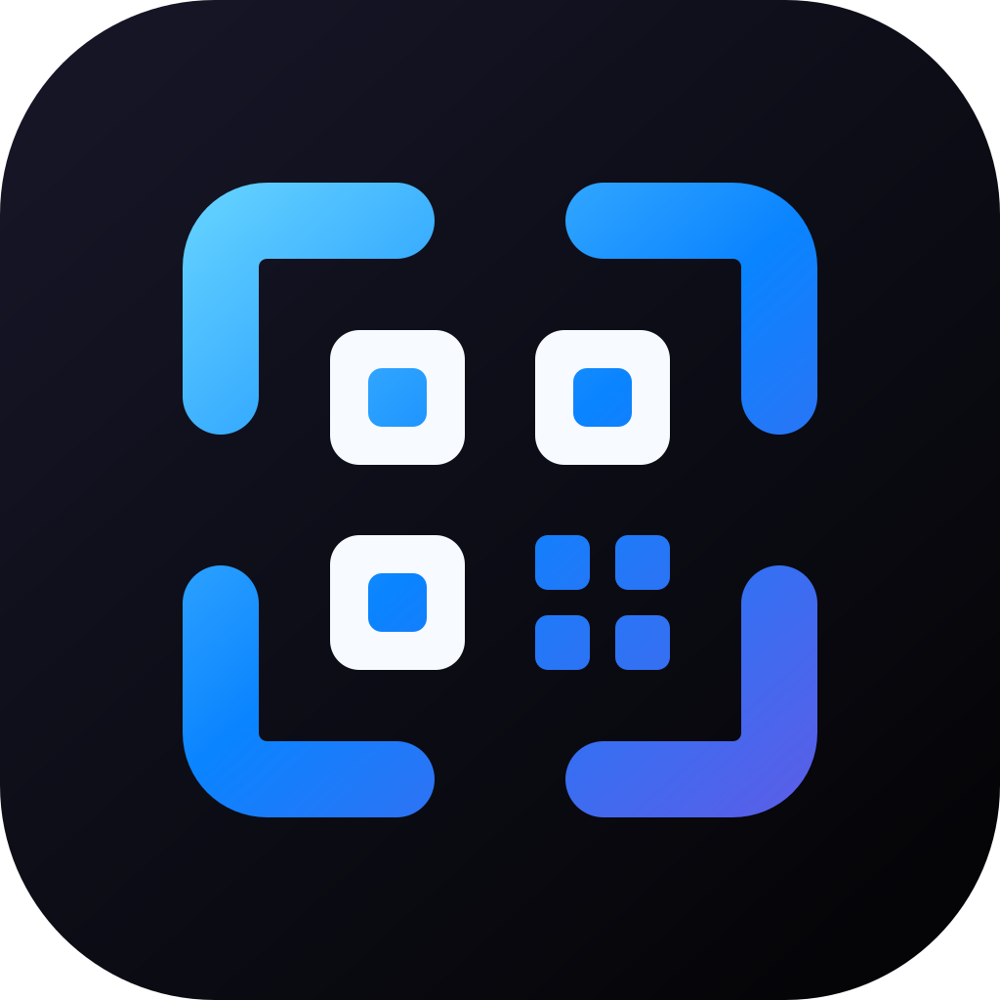

<p align="center">
  
</p>

<h1 align="center">Beam</h1>

<p align="center">
  <strong>A lightweight, native, privacy-first screen QR code reader for the macOS menu bar.</strong>
</p>

<p align="center">
  <a href="https://github.com/bhargavkukadiya/beam/actions/workflows/ci.yml"></a>
  <a href="https://github.com/bhargavkukadiya/beam/releases"></a>
  <a href="https://apple.com/macos"></a>
  <a href="https://swift.org"></a>
  <a href="#privacy--security"></a>
  <a href="LICENSE"></a>
</p>

---

## Table of Contents

- [Overview](#overview)
- [Features](#features)
- [Supported Payloads](#supported-payloads)
- [Installation](#installation)
- [Keyboard Shortcuts](#keyboard-shortcuts)
- [Privacy & Security](#privacy--security)
- [Architecture & Modular Design](#architecture--modular-design)
- [Building from Source](#building-from-source)
- [Release Packaging & Notarization](#release-packaging--apple-notarization)
- [Contributing](#contributing)
- [Changelog](CHANGELOG.md)
- [License](#license--attribution)

---

## Overview

**Beam** is a fast, unobtrusive macOS menu bar utility for scanning QR codes directly from your screen. Built with pure Swift, AppKit, ScreenCaptureKit, and Apple's Vision framework, Beam requires **zero third-party dependencies** and runs **100% offline**.

---

## Features

- ⚡ **Native & Lightweight**: Pure Swift, AppKit, and SwiftUI without Electron, web wrappers, or bloated runtimes.
- 🔒 **100% Offline & Private**: All image processing and barcode recognition happens on-device via Apple's Vision framework. Zero telemetry, zero analytics, zero network requests.
- 🛡️ **Privacy-First History**: History retention is **opt-in and disabled by default**. Passwords and OTP secret seeds are automatically masked with `••••••••` before saving.
- 🖥️ **Multi-Monitor Ready**: Crosshair selection overlays activate across all connected monitors with space-drag repositioning.
- 🎯 **Contextual Action Handlers**: Instant actions for URLs, Wi-Fi networks, Contacts (vCard/MECARD), Two-Factor Auth (OTP), JSON, and plain text.
- 🔏 **Hardened Runtime**: Built and signed with Apple's Hardened Runtime enabled (`--options runtime`).

---

## Supported Payloads

| Payload Type | Detected Formats | Primary Actions |
| :--- | :--- | :--- |
| **Web URLs** | `https://`, `http://`, plain domains | Open in default browser, copy link, share sheet |
| **Wi-Fi Networks** | `WIFI:S:...;T:...;P:...;;` | Copy password, open macOS Wi-Fi Settings |
| **Contacts** | `BEGIN:VCARD`, `MECARD:` | Save directly into macOS Contacts, call phone, send email |
| **Two-Factor Auth** | `otpauth://totp/...`, `hotp` | Open in default Authenticator app, copy secret seed |
| **JSON Data** | Valid JSON dictionaries or arrays | Formatted syntax-colored tree view, quick copy |
| **Plain Text** | Any arbitrary string payload | One-click clipboard copy, macOS system share sheet |

---

## Installation

### Pre-built Binary (GitHub Releases)

1. Download the latest `Beam-*.zip` from [Releases](https://github.com/bhargavkukadiya/beam/releases).
2. Unzip the archive and drag **`Beam.app`** into your `/Applications` folder.
3. Launch Beam from Spotlight or Applications.

> **Note on macOS Gatekeeper:**
> Because Beam is distributed as an independent open-source project without an annual Apple Developer subscription ($99/year), macOS Gatekeeper displays an unverified developer warning on first run.
>
> To open:
> - Open **System Settings → Privacy & Security**, scroll to the Security section, and click **Open Anyway**.
> - *Or run this command once in Terminal:*
>   ```bash
>   xattr -cr /Applications/Beam.app
>   ```

---

## Keyboard Shortcuts

| Shortcut | Action |
| :--- | :--- |
| <kbd>⌘</kbd> + <kbd>⇧</kbd> + <kbd>2</kbd> | Trigger screen QR code capture overlay |
| <kbd>Space</kbd> *(while dragging)* | Reposition the selection rectangle |
| <kbd>Esc</kbd> | Cancel capture |
| <kbd>⌘</kbd> + <kbd>C</kbd> | Copy scanned payload to clipboard |
| <kbd>⌘</kbd> + <kbd>W</kbd> | Close result window |

---

## Privacy & Security

Beam was built with user privacy as its core architectural foundation:

1. **Opt-In History**: Scanned QR codes are **never persisted to disk** unless you explicitly check **"Save Scan History"** in the menu. Disabling history immediately purges stored records.
2. **Credential Redaction**: When history is enabled, Wi-Fi network passwords and OTP secret seeds are automatically replaced with `••••••••` to prevent plaintext credential exposure.
3. **URL Scheme Allowlist**: Safe standard schemes (`http`, `https`, `mailto`, `tel`, `sms`, `maps`, `geo`) open directly. Custom, local, or hazardous schemes (e.g. `terminal://`, `applescript://`) require explicit user confirmation before opening.
4. **Zero Networking**: Beam contains no URLSession networking code, analytics trackers, or third-party telemetry libraries.
5. **Hardened Runtime & Minimal Entitlements**: Packaged binaries run with Apple's Hardened Runtime enabled (`--options runtime`). System permissions are requested just-in-time only when triggered by the user:
   - **Screen Recording**: Required by macOS ScreenCaptureKit solely to crop the selected screen region during an active scan.
   - **Contacts**: Entitled via `com.apple.security.personal-information.addressbook` and requested only when you click "Add to Contacts".

---

## Architecture & Modular Design

The repository is organized into cleanly separated targets:

```
Sources/
  BeamCore/                       # SwiftPM Library Target (Zero UI dependencies)
    Models/                       # Domain models (WiFiInfo, ContactInfo, OTPInfo, ScanResult)
    Parsing/                      # URL scheme validation and actionable link extraction
    History/                      # Opt-in persistence, credential sanitization, and migration
  BeamApp/                        # SwiftPM Executable Target
    App/                          # AppKit lifecycle, status bar menu, global Carbon hotkey
    Capture/                      # Multi-monitor overlay windows and ScreenCaptureKit pipeline
    Results/                      # Floating result panel controller
    UI/                           # SwiftUI result card, action buttons, and share sheet
Tests/
  BeamCoreTests/                  # Core domain tests (Privacy sanitization, parsing, URL security)
  BeamAppTests/                   # Presentation tests (Result panel lifecycle and callbacks)
Resources/                        # High-resolution vector AppIcon.svg and multi-size AppIcon.icns
Config/                           # Info.plist and Hardened Runtime entitlements
Scripts/                          # Universal packaging (build-app.sh) and Apple notarization (notarize.sh)
```

---

## Building from Source

### Prerequisites

- macOS 13.0 or later (macOS 14+ recommended for ScreenCaptureKit)
- Xcode 15+ or Command Line Tools installed

### 1. Clone the Repository

```bash
git clone https://github.com/bhargavkukadiya/beam.git
cd beam
```

### 2. Run Automated Tests

```bash
# Standard test run
swift test

# Verify strict concurrency
swift test -Xswiftc -warnings-as-errors -Xswiftc -strict-concurrency=complete
```

### 3. Verify Code Formatting

```bash
xcrun swift-format lint --strict --recursive Sources Tests Package.swift
```

### 4. Build Universal Release App Bundle

```bash
./Scripts/build-app.sh
```

The compiled `Beam.app` bundle and `Beam-*.zip` distribution archive will be placed in the repository root.

---

## Release Packaging & Apple Notarization

For maintainers with an active Apple Developer Program membership:

```bash
# Build, sign with Developer ID, and notarize via notarytool
SIGNING_IDENTITY="Developer ID Application: Your Name (TEAM_ID)" \
NOTARIZE=true \
NOTARY_KEYCHAIN_PROFILE="AC_PASSWORD" \
./Scripts/build-app.sh
```

---

## Contributing

Contributions are welcome! Please review [CONTRIBUTING.md](CONTRIBUTING.md) for architecture guidelines, coding standards, and our pre-submission checklist. All participants must adhere to the [Code of Conduct](CODE_OF_CONDUCT.md).

---

## License & Attribution

Beam is licensed under the [MIT License](LICENSE).

The application icon was custom-designed for Beam and is distributed under the same MIT License. Editable vector source is available in `Resources/AppIcon.svg`.
